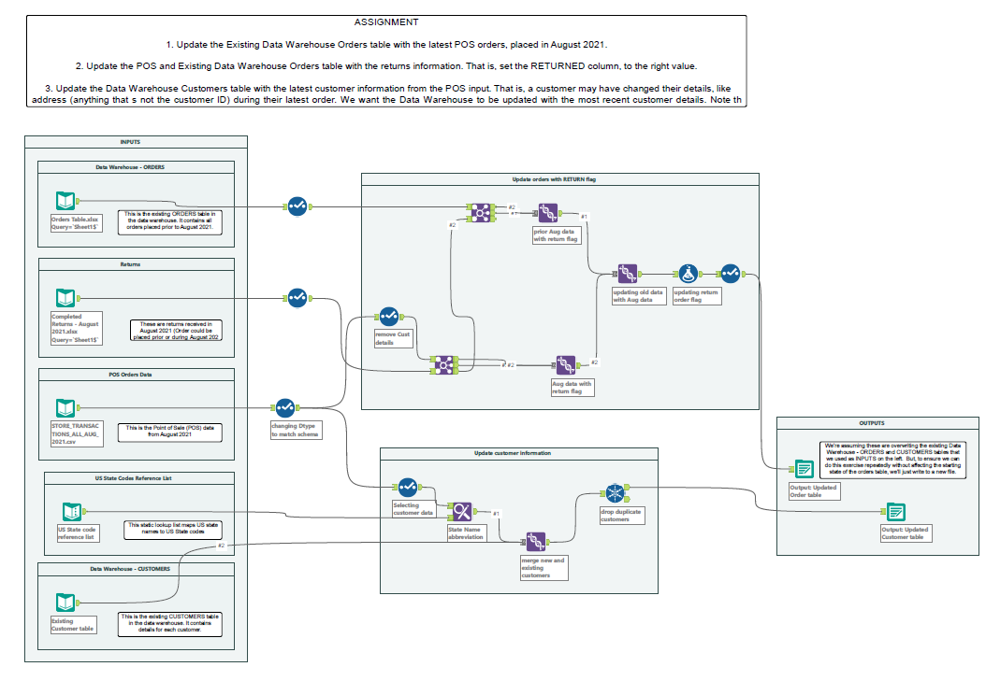

# ETL-pipeline-with-Alteryx-tool

## Overview:
Alteryx is a powerful data analytics platform that enables users to prep, blend, and analyze data from various sources quickly and efficiently, without needing extensive coding skills. It simplifies complex data workflows, making it easier to derive insights and make data-driven decisions.

## Requirements:
- Alteryx Designer installed on your system.
- Access to necessary data sources (databases, APIs, files) for extraction.
## Getting Started Installation:
1. **Installation:** Install Alteryx Designer from [Alteryx](https://www.alteryx.com) website.
2. **Setup:** Clone this repository to your local machine.
3. **Usage:** Open Alteryx workflows (*.yxmd) in Alteryx Designer to explore and execute the ETL processes.

## Workflow
This diagram illustrates a simple data flow:
- Extracts Orders, Customers, and Return Orders data.
- Transforms the Return Orders data, updating Customer information.
- Loads the transformed data into the destination data source.

- `ETL_pipeline.yxmd:` Demonstrates a sample ETL workflow using Alteryx. This workflow includes steps for data extraction, transformation, and loading.

## Features Data Extraction:
- **Data Extraction:** Utilizes Alteryx connectors to fetch data from diverse sources such as databases, APIs, and files.
- **Data Transformation:** Implements transformations like cleaning, filtering, aggregating, and joining data using Alteryx's intuitive workflow interface.
- **Data Loading:** Outputs transformed data to destinations such as databases, data warehouses, or local files.

